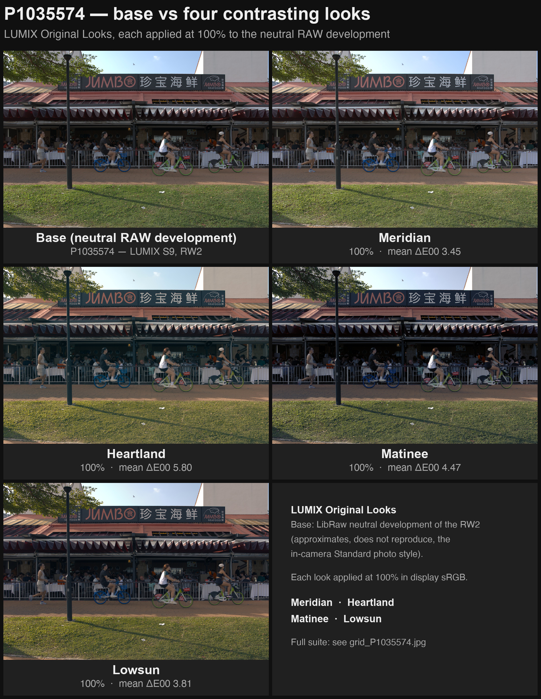
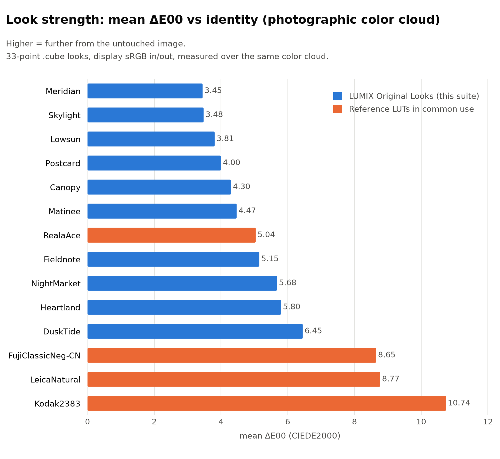

# LUMIX Original Looks

[中文说明](README.zh-CN.md)

Ten original 33-point `.cube` looks for the LUMIX Real Time LUT feature (designed on a LUMIX S9, **Standard photo style + sRGB** base), computed **from scratch as pure math** — no sampling, conversion, or curve-fitting of any existing commercial LUT. The full parametric generator, QC suite, and preview tooling are included; every aesthetic decision in every look is an explicit, inspectable parameter.

A position the author wants stated up front: **choosing a look — and how hard to apply it — is itself part of the artistic act of photography.** At the same time, mild distortion and color cast can feel novel, and novelty is easily mistaken for artistry: the deviation itself carries no artistic content. It only acquires meaning through the photographer's deliberate choice. These LUTs are offered as instruments for that choice, not as substitutes for it.

> **Authorship note:** everything in this repository — the look designs, the code, the LUTs, the docs — was generated by Anthropic's **Claude Fable 5**, working with the repo owner who set the brief, provided feedback and shot the sample photos.

## The looks

| Look | Group | Character | Suggested in-camera opacity |
|---|---|---|---|
| **Fieldnote** | Generalist | Neutral C-41-style daily negative: long toe, slate shadows / straw highlights, restrained color | 85–100% |
| **Heartland** | Generalist | Warm portrait negative for family, skin, indoor tungsten | 75–85% |
| **Meridian** | Generalist | Bright, honest daylight look with a measured-neutral gray axis | 100% |
| **Matinee** | Generalist | Cinema print density — deep but readable blacks, color as a whisper | 80% (avoid <60%) |
| **Postcard** | Generalist | Reversal-style hue purification + micro-density: purer, not louder | 75–100% |
| **Skylight** | Generalist | Light-ratio restructure: open shadows, compressed highlights, vivid clean color, zero cast | 75–100% |
| **NightMarket** | Scene | Mixed-light night: tungsten/sodium pulled to clean gold, LED anti-posterize | 75–85% |
| **DuskTide** | Scene | Blue hour: indigo shadows against lamp gold | 70–85% |
| **Canopy** | Scene | Tropical greens layered by luminance — teal-green shade, yellow-green lit leaves | 75–90% |
| **Lowsun** | Scene | Golden hour: gold-amber highlights vs cool shadows, hands over to DuskTide | 70–90% |

Film grain: recommended **OFF** for all looks (backup low values are noted in `luts/manifest.json`).

## Quick start

1. Copy any `.cube` files from [`luts/`](luts/) to the **root** of an SD card.
2. Camera: `Menu → Photo Style / LUT library → Import` (on the S9: gear icon → LUT → Load).
3. Shoot with the LUT applied on the **Standard** photo style (or a Real Time LUT slot), and use the in-camera opacity control — the table above gives per-look starting points. 100% is a complete, deliberate look; opacity is a creative control, not a safety net.

## Previews





Real-photo comparisons rendered from RW2 raws via a neutral LibRaw development that *approximates* (is not identical to) the in-camera Standard engine — see `render_demo.py`:

- `previews/demo/grid_*.jpg` — each scene × (base + all 10 looks)
- `previews/demo/hero_*.jpg` — larger side-by-side of contrasting looks
- `previews/strength_chart.png` — measured look strength (mean ΔE00 vs identity over a photographic color cloud) against common reference LUTs
- `previews/curves.png` — neutral-axis transfer + split-tone cast structure vs references
- `previews/chart_*.jpg` — synthetic gray ramps and RGB/CMY ramps per look

## Design approach (short version)

All color work happens in **OKLab/OKLCh** through a fixed operator pipeline (`looks/pipeline.py`), with each look defined purely by parameters (`looks/params.py`):

- monotone Hermite tone curves (mid-gray placement, toe length, shoulder roll-off stated in L*)
- split-toning with luminance windows and white/black guards
- hue-vs-hue moves, hue attractors, luminance-layered hue (Canopy)
- vibrance + soft-knee chroma compression (highlights never clip to posterized color)
- a suite-wide **skin protection window** (OKLCh hue 30–70°, feathered) so faces behave consistently across all ten looks
- constant-lightness, constant-hue gamut projection (no per-channel clipping)

Structural guarantees, enforced by construction and verified by QC: white maps to exactly `[1,1,1]` (<1e-6), the gray axis is strictly monotone in perceptual lightness, and mid-gray lands within ±0.5 L* of its design target.

**Strength philosophy:** measured against common reference LUTs, much of their "strength" turns out to be global darkening (one popular look sits 8–12 L* under the identity line along the entire gray axis). These looks take the opposite bet: the neutral transfer stays near identity — *your exposure is your exposure* — while the strength (ΔE00 3.5–6.5 vs identity, the Reala-Ace band) comes from bold split-tone color structure (±10–29/255 cross-cast, larger than the references' ±5–12).

## QC

`qc_looks.py` gates every generated cube: neutral-axis monotonicity and white/black anchors, mid-gray placement, lattice second-difference smoothness limits (with chart-based visual arbitration above a warning threshold), skin-tone drift as *perceptual displacement* (hue angle inflates spuriously at low chroma), cross-exposure skin stability, and an originality check — nearest-neighbor chroma ΔE00 against 42 existing commercial LUTs is **≥4.4** for every look (threshold 3.0). QC outputs live in [`qc/`](qc/).

## Repo layout / regenerate

```
looks/          color science, curves, operator pipeline, look parameters, cube I/O
generate.py     params -> 10 .cube + manifest.json
qc_looks.py     QC gates (see above)
render_demo.py  RW2 -> neutral base -> look comparisons (needs rawpy)
render_previews.py  contact sheets from your own photos
luts/           the shipped .cube files + manifest
```

```bash
python -m venv .venv && .venv/bin/pip install -r requirements.txt
.venv/bin/python generate.py --output luts
.venv/bin/python qc_looks.py --luts luts --output qc
```

Generation is deterministic: rebuilding produces byte-identical `.cube` files (sha256 in the manifest).

## Originality & honesty

These looks take *directional* inspiration from film families — C-41 negative, cinema print stock, reversal film — as mechanisms, not as targets. No look samples, converts, or emulates any specific film or existing LUT, and none claims to. All names are original. If you want a faithful film emulation, this is explicitly not that.

## License

[MIT](LICENSE). The `.cube` files may be used freely, including commercially; attribution appreciated.
