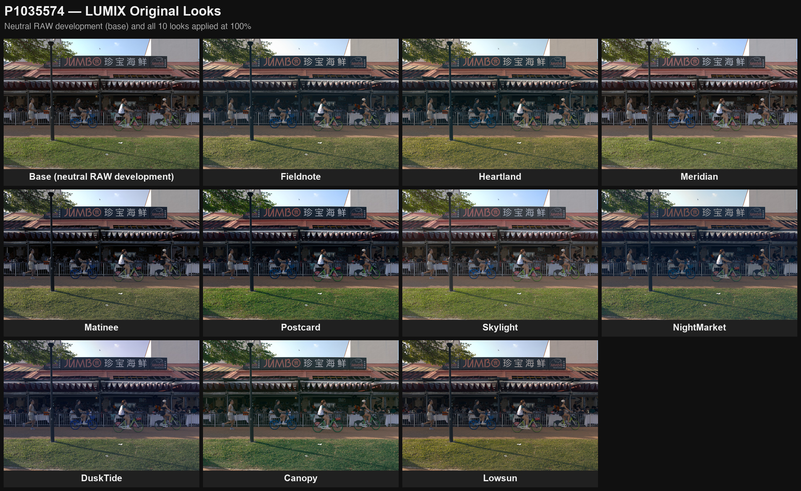

# LUMIX Original Looks（原创 LUT 套装）

[English](README.md)

为 LUMIX 实时 LUT 功能设计的 10 支原创 33 点 `.cube`（在 LUMIX S9 上以 **Standard 照片风格 + sRGB** 为基底开发），**完全从零由数学生成**——不采样、不转换、不拟合任何现有商业 LUT。仓库包含完整的参数化生成器、QC 套件与预览工具；每支 LUT 的每个审美决定都是一行可检查的参数。

作者补充立场：**选择一支 LUT、以及决定用多大强度，本质上也是摄影艺术创作的一部分。**但同时要清醒——轻微的失真与色偏固然能带来新奇的感受，而新奇很容易被误认为艺术性：偏离本身并不含艺术成分，它只有经由拍摄者的刻意选择才获得意义。这套 LUT 是为这种选择准备的工具，不是它的替代品。

> **作者声明**：本仓库的一切——LUT 设计、代码、成品文件、文档——均由 Anthropic 的 **Claude Fable 5** 生成；仓库所有者负责提出需求、给出反馈、拍摄样片。

## 十支 LUT

| Look | 分组 | 性格 | 建议机内强度 |
|---|---|---|---|
| **Fieldnote** | 泛用 | 中性 C-41 风格日常负片：长趾部、板岩蓝影/麦秆金高光、克制饱和 | 85–100% |
| **Heartland** | 泛用 | 暖调人像负片：家人、肤色、室内暖光 | 75–85% |
| **Meridian** | 泛用 | 明亮清透的"诚实日光片"，灰轴实测零漂移 | 100% |
| **Matinee** | 泛用 | 影院拷贝片密度：黑位深但有阶调，色彩只做耳语 | 80%（不建议 <60%） |
| **Postcard** | 泛用 | 正片式色相提纯 + 微密度：更纯，而不是更艳 | 75–100% |
| **Skylight** | 泛用 | 光比重构：阴影大开、高光压缩、鲜活干净零偏色 | 75–100% |
| **NightMarket** | 场景 | 混合光夜景：钨丝/钠灯收向干净金色，LED 防断层 | 75–85% |
| **DuskTide** | 场景 | 蓝调时刻：靛蓝阴影对灯火金 | 70–85% |
| **Canopy** | 场景 | 热带绿植按亮度分层：深荫青绿、受光叶黄绿 | 75–90% |
| **Lowsun** | 场景 | 金光时段：金琥珀高光对冷蓝阴影，与 DuskTide 接力 | 70–90% |

胶片颗粒：全系列建议**关闭**（备用低值见 `luts/manifest.json`）。

## 快速上手

1. 把 [`luts/`](luts/) 里的 `.cube` 拷到 SD 卡**根目录**；
2. 相机里导入（S9：菜单 → LUT → 读取）；
3. 在 **Standard** 照片风格（或实时 LUT 风格位）挂上 LUT 拍摄，机内实时调整强度——上表是每支的建议起点。100% 是完整、刻意的风格；强度是创作参数，不是保险丝。

## 预览




实拍对比由 RW2 原片经 LibRaw **中性解拍**渲染（近似但不等同机内 Standard 引擎，见 `render_demo.py`）：

- `previews/demo/grid_*.jpg` — 每个场景 ×（基底 + 全部 10 支）
- `previews/demo/hero_*.jpg` — 反差较大的几支放大对比
- `previews/strength_chart.png` — 强度实测（对恒等的平均 ΔE00）vs 常见参考 LUT
- `previews/curves.png` — 灰轴 transfer 与 split-tone 结构 vs 参考
- `previews/chart_*.jpg` — 每支的灰阶与 RGB/CMY 渐变图卡

## 设计方法（简版）

全部色彩操作在 **OKLab/OKLCh** 中完成，走固定算子流水线（`looks/pipeline.py`），每支 LUT 纯由参数定义（`looks/params.py`）：单调 Hermite tone 曲线、带亮度窗口与白/黑守卫的 split-toning、色相窗口手术与吸引子、vibrance + 软膝 chroma 压缩、全系列统一的**肤色保护窗**（OKLCh 30–70° 带羽化）、恒亮度恒色相的色域投影。

结构性保证（由构造成立、由 QC 复核）：白点精确映射 `[1,1,1]`（误差 <1e-6）、灰轴感知亮度严格单调、中灰落点 ±0.5 L*。

**强度哲学**：实测常见参考 LUT，其"强度"相当一部分来自全局压暗（某支流行 look 整条灰轴压暗 8–12 L*）。本套装反其道：灰轴贴近恒等——*曝光是你的*——强度（ΔE00 3.5–6.5）来自大胆的 split-tone 色彩结构（冷影/暖高交叉 ±10–29/255，超过参考的 ±5–12）。

## QC

`qc_looks.py` 对每支出厂 cube 把关：灰轴单调与白/黑锚点、中灰落点、晶格二阶差分平滑度（超警戒线转图卡目检）、肤色漂移按**感知位移**计（低饱和处色相角会虚高）、跨曝光肤色稳定性，以及原创性查重——对 42 支现有商业 LUT 的最近邻 chroma ΔE00 全部 **≥4.4**（门槛 3.0）。结果在 [`qc/`](qc/)。

## 目录与复现

```bash
python -m venv .venv && .venv/bin/pip install -r requirements.txt
.venv/bin/python generate.py --output luts
.venv/bin/python qc_looks.py --luts luts --output qc
```

生成是确定性的：重跑得到逐字节一致的 `.cube`（sha256 见 manifest）。

## 原创性与诚实

这些 LUT 从胶片"机理"取**方向性**灵感——C-41 负片、影院印片、正片——但不采样、不转换、不模拟任何具体胶片或现有 LUT，也不声称如此。命名全部原创。如果你要的是忠实胶片模拟，这套明确不是。

## 许可

[MIT](LICENSE)。`.cube` 文件可自由使用（含商用）；欢迎署名。
